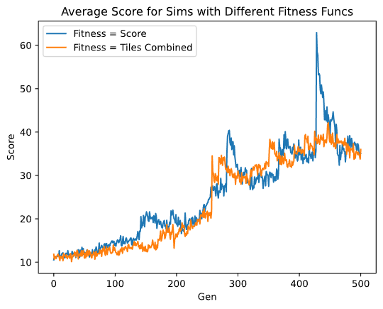
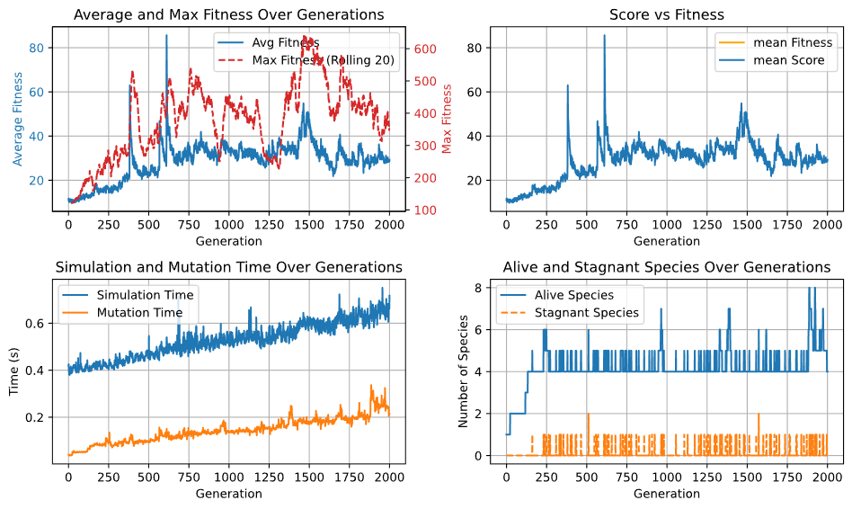
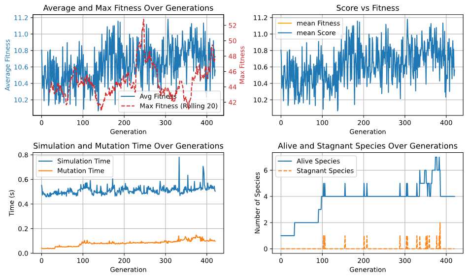
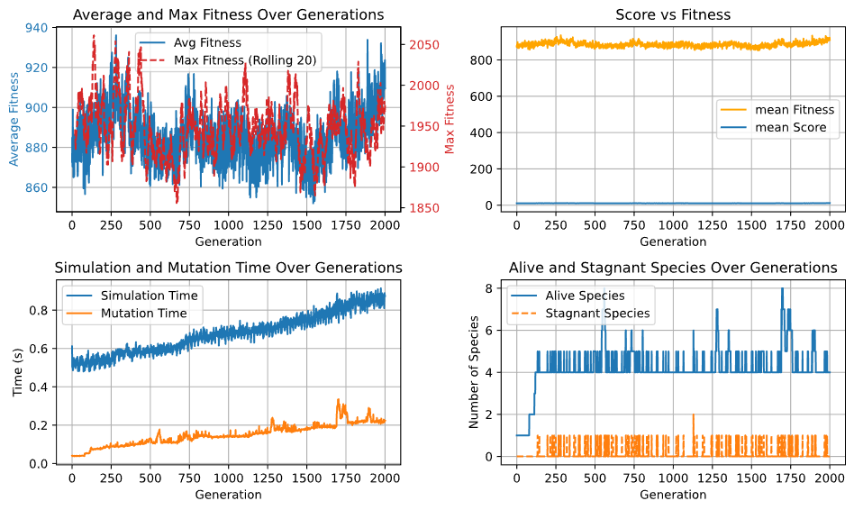
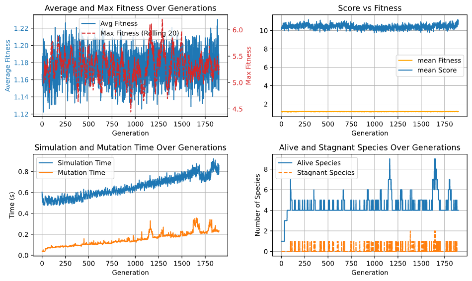
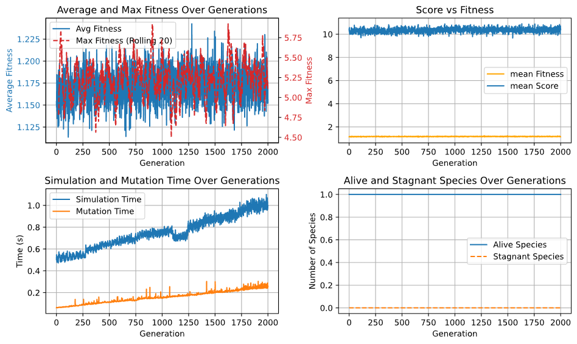
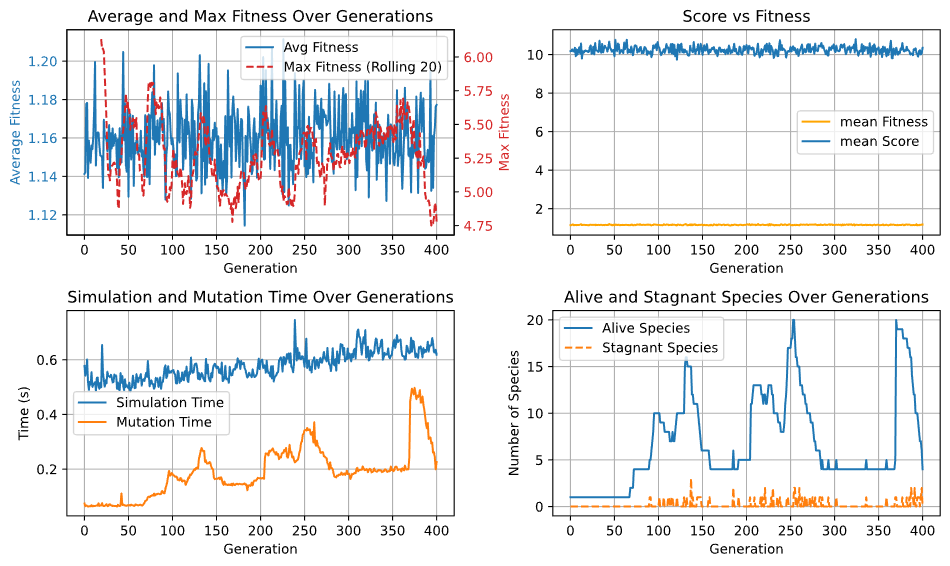
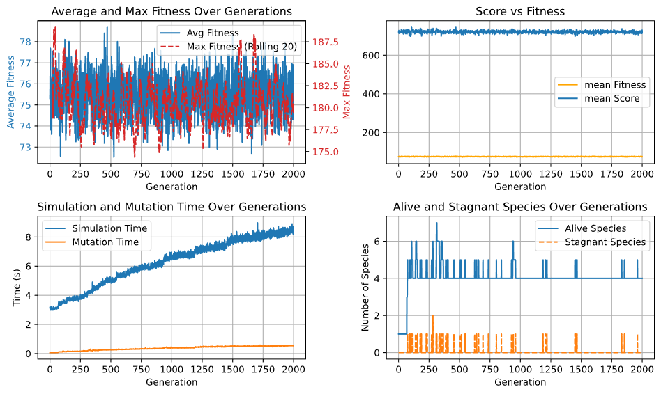
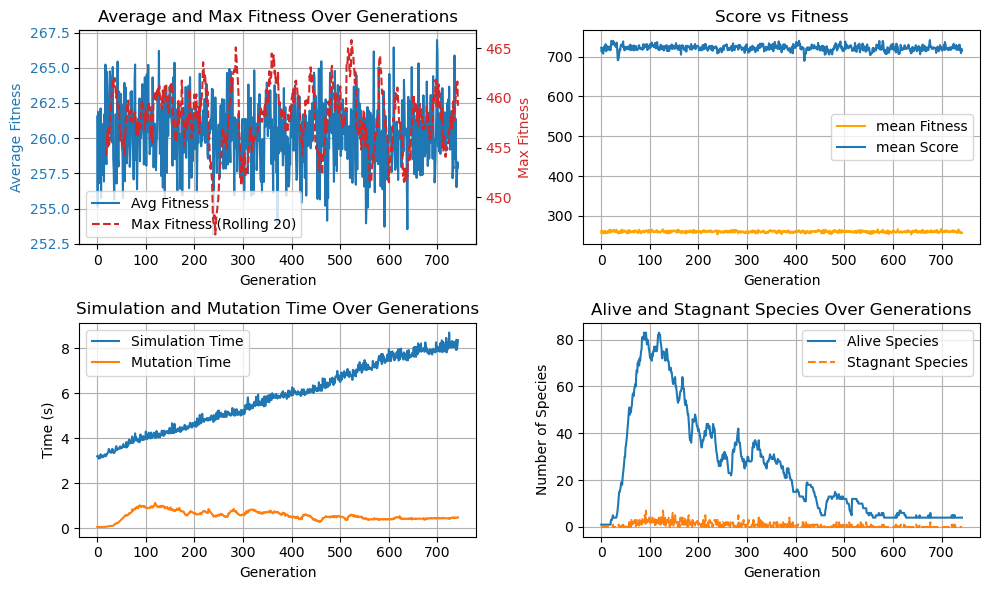

Thinking about different reward functions

1. Tiles Combined: This just counts the number of squares combined. It doesn't necessarily train a model to combine the largest
numbers, but rather to live as long as possible. It also teaches the model that 64 + 64 is equivalent to 2 + 2, which is not right.
So it's not very good. 

2. Highest number on board: 

3. Total tiles: The sum of tiles on the game board. 

3. Score: This is where I give it a reward of 2 if it accomplishes 2 + 2, 64 if it accomplishes 64 + 64. It's like 
Combined Count but it actually incentivizes the model to combine larger numbers.

4. Score + Empty Tile Count / move: Incentive the model to keep a clean board by adding 10 * empty tile count after every move.

4. Survival: Turns survived (or, number of moves made). I'd imagine this is correlated heavily wtih combined count. But it might be a useful
second order reward function that we can combined with something like Combined Numbers.


## Comparing Score vs Tiles Combined
<p align="center">
  
</p>

Since the Score reward is the actual "score" of the game, for all comparisons of fitness functions, we will compare the performance of a neural network based 
on it's score in the game. The score acts as a ground truth, in a sense. In this plot above, we see that the simulation with Score as the fitness function
and Tiles Combined as the fitness function essentially equally as fast, at least in the 500 gens that we ran it for. However, I've ran the Tiles Combined to
2000 gens and observed platuea behavior around score 15, so I will try running 2000 gens with Score fitness and see what happens.

<p align="center">
  
</p>

We see the same plateau behavior around gen 500. So, a different fitness function didn't save us. What now?

## Averaging Fitness Over Multiple Runs
I'm going to try making the NN play the game N number of times, and averging that as it's fitness. In that way, we get a better estimate for the NN's
performance. Look at the graph above, we see large spikes. I initially thought those were generations with a bunch of "savants" but I think that might
just be generations with a bunch of "lucky idiots" as Gemini puts it. We're going to run 5 game plays per Sandbox and see if that helps us. 

I thought this would destory the runtime (or, more elegantly, 5x it), but no. The sim time for gen 1 went from 0.3 to 0.5 seconds, so that tells me
maybe the multiprocessing overhead is dominating the cost so far. This is good news. Here are the results of doing the 5 sample averaging. 

<p align="center">
  
</p>

Soooo, the network isn't actually learning anything it seems... That's a bit off bc in the previous runs we did see it steadily climb to a score of about 40,
then plateau around there. I'll add some thoughts about why later. Regardless of the reasons, it seems this Score only fitness function isn't working.

## Score + Empty Tile Count Fitness Function
We need to update the fitness function. I think what we need to do is add a more dense reward. For this, maybe we can focus on the board structure
itself. It is good game play to have many empty slots (to not clutter the board, in other words), so maybe we can add a bonus for that at every round.
This makes the reward more dense too (or, more high definition? sort of), so that might help distinguish a NN that randomly playeed and got to score 20,
vs a NN that played smartly by keeping tiles open and got to 20. The second NN should have a higher fitness because of the way it played.

$$
\text{Fitness} = \text{Final Score} + \sum_{t = 0}^{t_{end}} \text{Empty Tile Count at } t \cdot 10
$$

So, this heavily pressures the NN to keep tiles empty. I ran this for 2000 generations. 

<p align="center">
  
</p>

So, not so great again. The fitness doesn't seem to really be increasing overtime. The score pretty much stays flat the entire time so
we know the model isn't doing so hot. The *10 on the empty tile heuristic might have been a bit overkill. Maybe it incentivizes the model
to just sit around; afterall,
it can get like 1000 points just by observing 100 empty tiles, so that's like 100/16 = 6 empty boards roughly. Miss Gemini recommends me
to 1. lower the heuristic multiplier (reasonable), or to only add the bonus at the end. I'm not a fan of adding at the end because you're likely
to die to having a full board, so you won't get too much good signal from that I feel. I can scale it down to like 0.1 or 0.5 or something. Another thing
I will do is take the min of the fitness observed over 5 runs, rather than the average. The average is too sensitive to outlier simulations 
where continually pressing up happened to yield moderately good results. Ok, time to sim.

<p align="center">
  
</p>

Ok, so still pretty bad. The average minimum fitness is basically telling us that on average, the NNs are only getting about 0.15 fitness, which corresponds to
15 empty tiles. That's basically just being stuck on the first move. And I've seen that behavior before. For example, if we inspect the moves our best genome
from this simulation does on 10 random games, this is what it does.

```
Full Fitness History    12.6   7.1  11.6  66.1  19.3  35.9  43.7  10.4   8.1   4.9
Full Scores History        5     3     5    45     9    21    25     5     3     1
[↑↑↑↑↑]
[↑↑]
[↑↑↑↑]
[↑↑↑↑↑↑↑↑↑↑↑↑↑↑↑↑↑↑↑↑↑]
[↑↑↑↑↑↑↑↑]
[↑↑↑↑↑↑↑↑↑↑↑↑↑]
[↑↑↑↑↑↑↑↑↑↑↑↑↑↑↑↑↑↑]
[↑↑↑]
[↑↑↑]
[↑↑]
```

It really is just dumb lukc that this netwrok is getting 45 on certain games. So, I think we need some more diversity. DEI! How to do this is I will
increase the various chances of mutation. Specifically, we make the following changes.

```
NEURON_ADD_CHANCE = 0.03 (used to be 0.001)
SYNAPSE_ADD_CHANCE = 0.05 (used to be 0.005)
SYNAPSE_WEIGHT_CHANGE_CHANCE = 0.8 (used to be 0.01)
SYNAPSE_SWITCH_CHANCE = 0.05 (used to be 0.005)
```

Following Gemini's advice, I also changed the weight mutation method. Previously, I would just sample a completely new weight, but now I sample from a 
gaussian with $\mu = 0$ and $\sigma = 0.5$. This "perturbs" weight, rather than randomly rolling for a weight. I also normalize the inputs to the NN
from a range of [0, 15] to [0, 1], so it plays well with th sigmoid activation.

Let's see how it does on 2000 gens. This did not work.

<p align="center">
  
</p>
The issue that pops out to me here is that there was only one species throughout. I adjusted my speciation threshold, as well as the distance calulation
weights as the following. I looked at the original paper, and those numbers did not work, so here's the numbers I eventually got to. This results in a
consistently over 6 ot 7 species at every generation, with occasional explosions.

```
# parameters for NetworkGenome gene distance
W_DISJOINT = 1.5
W_EXCESS = 1.5
W_WEIGHT = 0.3

SPECIATION_THRESHOLD = 0.6
```
<p align="center">
  
</p>
Ok, I am starting to lose hope. It's still not learning ANYTHING! For our next move, we will focus on the fact that our NN starts out only playing one move. 
We somehow need to be able to make different moves, even if the network predicts the same move over and over again. For this, Gemini had the a great idea
implement move fallback. We sort the moves in softmax order, then start from the most confident move. If that doesn't make the board change, we move to the 
next move, and so on. We only truly get stuck if we exhaust all options (ie, the board is actually stuck)! This actually seems pretty promising, let's see
what happens.

## Implemeting move fallback
This allows the NN to still play the game, even if the top prediction is an invalid move (like, move into the wall). THe way I implemented it is a simple
sorting of the neurons by activation, and we try the highest move first, second highest move next, etc. This allows the model to get signal from the simulation,
even when it is really bad. So I was hopeful that this might work.

<p align="center">
  
</p>

Nnnnnnooooooppe! Doesn't work. The fitnesses are stubbornly low and flat. Ok, so I got stuck and was going back and forth with Gemini. I decided to add a penalty
for trying illegal moves, because, afterall, we do want to incentive the model to take legal moves eventually. So we multiply a penalty factor by 0.99 every time
the model tries an illegal move, and scale the reward at the end by that factor, like so. 

```py
def Sandbox.make_next_move():
  ...
  # if you made an illegal move i times
  self.accumulated_penalty_factor *= (INTENT_PENALTY ** i)
  ...
  # at the end,
  return reward * self.accumulated_penalty_factor
  ...
```


This is a sound change. Also, while I was changing the code, I realized that there
was somewhat of a major error... In `Simulation.run_worker()`, we return the AVERAGED mininmum fitness. That doesn't make sense at all! So I fixed the division 
for the minimum fitness, and hopefully with these two changes the model can learn. Ok, sim time. 

```
def run_worker(genome):
    # 1. LIGHTWEIGHT: Receive only the genome data
    # 2. HEAVY WORK: Create objects inside the worker (Local memory)
    net = nn.Network(genome)
    sandbox = Sandbox(net) 

    fitnesses = []
    scores = []

    for _ in range(SAMPLES):
    
        while True:
            try:
                sandbox.set_input()
                # FIX: Pass the required argument
                sandbox.make_next_move()
                sandbox.reset_update()
            except Exception:
                sandbox.network.clear()
                # Return fitness when game ends
                fitnesses.append(sandbox.network.fitness)
                scores.append(sandbox.game.score)
                sandbox.factory_reset()
                break
    return min(fitnesses) / SAMPLES, sum(scores) / SAMPLES # <----------- THIS LINE!!! WE SHOULDNT / SAMPLE!!!

```

This didn't work either. I was really stumped so I decided to do a good-ol google search. As I was reading articles, I realize that I had a major
bug in my code. So let me fix that first.

## Critical Bug Fix Time
I believe that there is a bug within the mutating function. Specifically, the tracking of genomes with innovation number. Previously, I was under the assumption of the following:

```
# we decide to add a new synapse to Network A
# Innovation Number = 5
SynapseGene(outof = Neuron 1, into = Neuron 2, Innovation Number = 5) (NEW CONNECTION)
Innovation Number += 1 # increment

# we decide to add the SAME synapse to Network B
# Innovation Number = 6
SynapseGene(outof = Neuron 1, into = Neuron 2, Innovation Number = 6) (NEW CONNECTION)
Innovation Number += 1 # increment
```

So, I thought if the same structure arose (in this case, a synapse connecting Neuron 1 and 5), it would be given a
different innovation number. However, it seems that the authors meant that they need to be given the same ID. This is
somewhat the whole point of the genome matching aspect of NEAT, so that was an oversight on my part. To implement this fix,
I will add a global dictionary that keeps track of innovation ids for both neurons and synapses. How is works is the follwing.

```py
class InnovationTracker():
    neuron_tracker = {}
    synapse_tracker = {}
    SIN = 63
    NIN = 19

    @staticmethod
    def get_synapse_id(outof, into):
        # checks synapse tracker dict to see if we have a hit
        if (outof, into) in InnovationTracker.synapse_tracker:
            return InnovationTracker.synapse_tracker[(outof, into)]
        else:
            InnovationTracker.SIN += 1
            InnovationTracker.synapse_tracker[(outof, into)] = InnovationTracker.SIN
            return InnovationTracker.SIN
    
    
    @staticmethod
    def get_neuron_id(outof, into):
        # checks synapse tracker dict to see if we have a hit
        if (outof, into) in InnovationTracker.neuron_tracker:
            return InnovationTracker.neuron_tracker[(outof, into)]
        else:
            InnovationTracker.NIN += 1
            InnovationTracker.neuron_tracker[(outof, into)] = InnovationTracker.NIN
            return InnovationTracker.NIN

# when we want to add a new neuron/synapse, heres what we do
if neuron_add:
    to_disable = random.choice(self.enabled_synapses)
    to_disable.is_on = False
    self.enabled_synapses.remove(to_disable)
    neuron_id = InnovationTracker.get_neuron_id(to_disable.outof.id, to_disable.into.id) <--- we let the tracker handle the innovation ids
```
Now, with this bug fixed, let's try again. To recap, we have a reward function that considers the overall score, empty tile bonus, and then now has a penalty factor proportional to the number of illegal moves the NN tried to make. With this major bug fix, I am feeling
cautiously optimistic, but here we go.


<p align="center">
  
</p>

So yea, didn't work. I lowered the speciation threshold so the species has a curious pattern but I doubt that that was the issue. I think there's something wrong still. I do know that the progenitor logic is different in mine vs the neat-python
library. In mine, the progenitor never changes (I thought this made sense), so unless species 0 stagnates, the species 0 progenitor will always be from the first gen. In neat=python, they pick a random speciment from the species and make
that the next progenitor, so that way the species "mean" or "center" is always shifting.
Maybe I will implement that. There's also first-fit and best-fit criteria for speciation (like, do I put network A in the first species that the distance is less than the speciation threshold, or do I check against all the species and put it
in the most compatible one). I might experiment with that, but after I change the progenitor logic.

I'm not even going to bother putting the training results here but it didn't work. I'm really stuck, so I went on google to see if anyone had made a blog post,
youtube video, etc about applying NEAT to 2048. I found this [repo](https://github.com/qw/2048-neat?tab=readme-ov-file) that does exactly what I'm trying to do,
except using the neat python package. 

Here, they use a neat (haha, get it) fitness function that incorporates the notion of board smoothness. Here it is:
$$
\text{fitness} = \frac{\text{score} \cdot w_{score}}{\text{smoothness} \cdot w_{smoothness}} \cdot \log_2(\max(\text{board})) \cdot -1\\
$$
Smoothness is calculated like the following:

```py
def smoothness(board):
    smoothness = 0
    for (t1, t2) in all pairs of adjacent tiles:
        smoothness -= abs(log2(t1) - log2(t2))
    return smoothness
```

The intuition for smoothness is that a board that has 32 and 64 adjacent is better than 64 and 2. The smoothness factor for the first case
is -1, whilst the second case is -5, quantifying how close each square. It's useful to bunch together close by numbers rather than far
away tiles, so this smoothness heuristic is useful.
