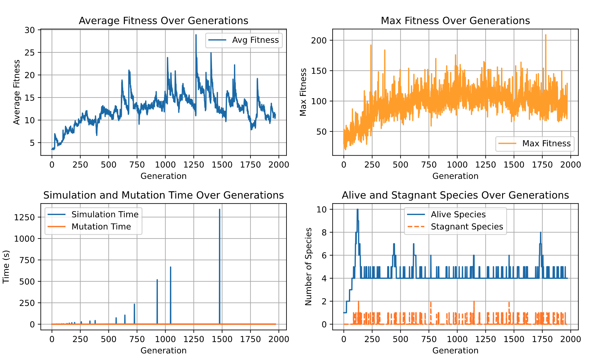

This document details the investigation of the phenomena where simulation() runtime would sometimes, seemingly randomly
explode. Below is an example output of time logging functionality I've put in my code to keep track of runtime anomalies. 

```
# this is generation 166
(max, avg) unadjusted fitness of generation 166 = (58, 5.758)
sandbox creation: 0.069
make next move: 0.273
mutate: 0.036, simulate: 0.343

# this is generation 167, the next generation
(max, avg) unadjusted fitness of generation 167 = (62, 5.839)
sandbox creation: 9.553 <--- takes x13 times more to run, compared to previous generation
make next move: 0.394
mutate: 0.042, simulate: 9.948
```


For some context, this is what the simulation loop looks like.

```
a = Simulation(1000) # 1000 individuals

for i in range(100): # 100 generations
    a.simulate()

    a.adjust_fitness()

    a.reproduce()

    a.mutate_and_speciate()
```

I will detail the steps I've followed to pinpoint the cause.

### #1: I add logging functionality for the main suspicious points in my code, which are `simulate()` and `mutate_and_speciate()`. 
- reasons why `simulate()` is sus
    - each of the networks play the game here, so it's reasonable that if the networks are sufficiently good, that this part might take a bit
    - if there are some edge cases where the network is getting stuck, and the game isn't terminating quickly enough, maybe this is causing the hellish runtime
    - we initialize `nn.Networks` from `nn.NetworkGenome` here, which might be costly.
        - this one was the most unlikely one, but I was surprised!
- reasons why `mutate_and_speciate()` is sus
    - must call `mutate()` for each individual. `mutate()` is costly to call, especially synapse addition because this involves finding two neurons that are not yet 
    connected to each other
    - must call `distance()` for each individual. `distance()` is also costly, as it scales linearly with network complexity (the number of synapse + neurons in the network).
- 
- Importantly, simulation + mutation time (which take up the bulk of the simulation loop) generally is very close to 0 throughout the generations. But, there are some large spikes, like around generation 1500, where simulation took nearly 1300 seconds (~20 minutes, x1200 times the typical time taken). This massively slows down the entire thing and needs to be fixed.  
- From this plot, we see that simulate() is the most likely culprit. For later steps, we focus our efforts digging into this.


### #2: We now know `simulate()` is causing delays. I used a profiler to easily see runtime by line.
```
Line #      Hits         Time  Per Hit   % Time  Line Contents
==============================================================
   166                                               @profile
   167                                               def simulate(self):
   168       146        225.0      1.5      0.0          now = time.time()                                           
   174       146        182.0      1.2      0.0          counts = f'{self.current_gen}, '
   175       146         93.0      0.6      0.0          self.sandboxes = []
   176    146146      20578.0      0.1      0.0          for genome in self.genomes:
   179    146000   45044745.0    308.5     26.1              net = nn.Network(genome)
   180    146000    1775735.0     12.2      1.0              sb = Sandbox(net, self.debug)
   181    146000      22815.0      0.2      0.0              self.sandboxes.append(sb)
   188       146       2255.0     15.4      0.0          print(f'sandbox creation: {(time.time() - now):.3f}')
   189       146         16.0      0.1      0.0          max_fitness = 0
   190       146         18.0      0.1      0.0          total_fitness = 0
   191       146         29.0      0.2      0.0          while_start = time.time()
   192    146146      48287.0      0.3      0.0          for i, sandbox in enumerate(self.sandboxes):
   193                                                       # print(f'individual {i}')
   194   1559428     174653.0      0.1      0.1              while True:
   195   1559428     140354.0      0.1      0.1                  try: # try to continue playing the game 
   196   1559428    4633652.0      3.0      2.7                      sandbox.set_input()
   197   1559428  104414782.0     67.0     60.4                      sandbox.make_next_move(self.reward_type)
   198   1413428   16396095.0     11.6      9.5                      sandbox.reset_update()
   199    146000      26186.0      0.2      0.0                  except Exception as e:
   200    146000      17953.0      0.1      0.0                      total_fitness += sandbox.network.fitness
   201    146000      20634.0      0.1      0.0                      if max_fitness < sandbox.network.fitness:
   202       628         81.0      0.1      0.0                          max_fitness = sandbox.network.fitness
   203                                           
   204                                                               # potentially update the max fitness for that species
   205    146000      41536.0      0.3      0.0                      if sandbox.network.fitness > self.species[sandbox.network.genome.species]['stats'][1]:
   206        48         22.0      0.5      0.0                          self.species[sandbox.network.genome.species]['stats'][0] = self.current_gen
   207        48         12.0      0.2      0.0                          self.species[sandbox.network.genome.species]['stats'][1] = sandbox.network.fitness
   208                                                               # print(f'Sandbox {i} finished with score of {sandbox.network.fitness}')
   209    146000      38645.0      0.3      0.0                      break # once a game has won, lost, or gotten stuck, break While loop, move onto new sandbox
   210                                                   
   219       146        178.0      1.2      0.0          self.current_gen += 1
```
- From this results, line 179, `nn.Network` construction from NetworkGenome drew my attention.
- It's mostly to be expected that `make_next_move` would be taking the bulk of our time, so investigating this is a lower priority.

### #3: Which line in `nn.Network(genome)` is causing delays? Again, I used a profiler.
```
Line #      Hits         Time  Per Hit   % Time  Line Contents
==============================================================
524                                               @profile
525                                               def __init__(self, genome: NetworkGenome):
526                                                   # first, express all neurons in genome
527   4234622     507313.0      0.1      1.0          for neuron_gene in genome.all_neuron_genes:
528   4051622   31276497.0      7.7     61.1              neuron_gene.express() # -----> this sets neuron_gene.expressed_neuron to an actual Neuron
529                                                   
530   3111000     522656.0      0.2      1.0          self.input_l = Layer([n.expressed_neuron for n in genome.input_neurons])
531    915000     223221.0      0.2      0.4          self.output_l = Layer([n.expressed_neuron for n in genome.output_neurons])
532    183000      22001.0      0.1      0.0          self.genome = genome
533                                           
534    183000      20271.0      0.1      0.0          self.fitness = 0 # used when there's conflicting genes during crossover
535    574622     187365.0      0.3      0.4          self.neurons = self.input_l.neurons + self.output_l.neurons + [n.expressed_neuron for n in genome.neuron_gene]
536                                           
537    183000      63168.0      0.3      0.1          self.sorted_neurons = list[Neuron]
538                                           
539  12960122   18401623.0      1.4     35.9          self.synapses = [s.express() for s in genome.synapse_gene]
```
- It looks like both line 528 and 539 are the most likely culprits. This is slightly puzzling, since the code for `.express()` for both neuron and synapse are very simple. It's shown below.
```
# NeuronGene expression
def express(self):
    self.expressed_neuron = Neuron(self.id, self.bias, self.activation_f)
# SynapseGene expression
def express(self):
    # Synapse.__init__() automatically connects self to outof Neuron
    return Synapse(self.id, self.outof.expressed_neuron, self.into.expressed_neuron, self.weight, self.is_on)
```
- Neither of these functions have searches, or anything that might seem costly. Yes, there are lots of calls, but I needed to look into it further.

### #4: Why is `nn.Network` construction taking super long?
My guess for why Network construction might be taking longer was that perhaps the networks are getting very complex at these specific times. If the network gets too complex (ie, too many neurons or synapses), the time to construct them should increase. So I inspected the number of avg/max neurons and synapses at each generation to see if there was any relationship. Below are the results.
<p align="center">
  
  
</p>
In both graphs, we see no compelling relationship between an increase in neuron/synapse count and simulation time. *The problem is not in network complexity explosion!*

### #5: What else could cause a runtime explosion of this degree?
Now, we need to look into the runtimes of synapse/neuron_gene.express() for each generation, and compared that with the simulation time spikes. 
This will give us a better idea of which line (either, synapse_gene or neuron_gene) is contributing mostly to the runtime explosions.

The below plots show the mean and max time `.express()` took for both neuron and synapse at each generation, compared against the simulation time.

<p align="center">
  
  
</p>

The max for `neuron_gene.express()` and `synapse_gene.express()` seem to closely match the simulation time when there is a spike. In the below graph, I combined the max times for both `.express()`. We see that this lines up even more closely to the simulation time graph.

<p align="center">
  
</p>

Besides the peak around 110, this graph closely matches the simulation time. From this, we can infer the following: when the simulation time spikes, it's mostly likely due to a single `.express()` call taking excessively long. For the next step, I'm going to try to identify what causes a single `.express()` call to take so long. ChatGPT suggests I look into the parameters that cause this (seems like a good idea), so I'll do this first.

## #6: Are there patterns when the spikes happen?

I profiled `Neuron.__init__()`. Below are the results

```
Total time: 2.69984 s
Line #      Hits         Time  Per Hit   % Time  Line Contents
==============================================================
    13                                               @profile
    14                                               def __init__(self, id: int, bias: float = None, activation_f = None):
    15   3573371     457355.0      0.1     16.9          self.id: int = id # innovation id of the neuron
    16   3573371     466520.0      0.1     17.3          self.bias = bias # the bias of the neuron
    17                                           
    18   3573371     390177.0      0.1     14.5          if activation_f is None:
    19   3573371     361122.0      0.1     13.4              self.activation_f = 'sigmoid'
    20                                                   else:
    21                                                       self.activation_f = activation_f
    22                                           
    23   3573371     421134.0      0.1     15.6          self.out_synapses: list[Synapse] = [] # set of synapses that are connected
    24                                           
    25   3573371     603533.0      0.2     22.4          self.value: float = 0 # attribute to hold input value to neuron
```

This total time bugs me. I know for a fact that in this run, there were times when my code got stuck on `neuron_gene.express()` for more than 2.7 seconds in a single call. In fact, I added some code that would print when a single express call exceeds 2 seconds, and I got one like the below.
```
ng.express() took 3.5254111289978027, parameters: (14, 0.23185592402350863)
sandbox creation: 4.518
make next move: 0.246
(max, avg) unadjusted fitness of generation 67 = (40, 4.2)
```

This print alone is telling me that a single call took 3.5 seconds. However, when I profile NeuronGene.__init__(), it tells me that the total time to execute this function was 2.5 seconds, which is less than that single `.express()` call. As a reminder, `.express()` just calls `__init__()`. I hope you understand my confusion here. 

After some research, it seems like this is just a result of various background operations Python does, like memory allocation and garbaga collection. Since there's 3.5 million calls to this function, it might be reasonable for a 1 second difference to emerge between manual timing and the profiler. 

Going back to the original question, there doesn't really seem to be anything specific about the parameter to `Neuron.__init__()` when it took 3.5 seconds. My guess now is, perhaps the spikes happen when theres significant memory operations, where some swap memory gets written or moved back to memory. When theres like 10 gigs of swap, this is probably not small feat. So I think next steps would be to somehow monitor memory usage at each generation, or to see file I/O to determine if any file writes are happening. 

## #7: Monitoring memory usage patterns and comparing them against runtime spikes
Based on the results from before, I added memory logging. Below is a graph of the memory usage vs runtime of simulation.
<p align="center">
  
</p>

We see in the later runtime spikes (gen 150 and after), RSS seems to dip, then spike at the same time as runtime spikes. This is interesting behavior. Why is the memory usage dipping at those specific points? I also see a pattern of dropping memory usage, then a spike once the memory usage drops down to some threshold. This pattern is is seen around the last two spikes. 

VMS is consistently increasing, which is also a troubling pattern, but the pattern is less attention grabbing than that of RSS, so I will zoom in on that first. 

At this point, a possibility I see is that thrashing is occurring during the spikes. Thrashing is when swap memory (which VMS includes) get "thrashed" back and forth between RAM and disk. This requires lots of read/writes on disk, which is slower than on RAM, which could cause major bottlenecks. I will investigate this further later, but first, I wanted to zoom in on garbage collector patterns to see if there was anything there. 

Side note: RSS stands for Resident Set Size. This represents the amount of bytes a given process (in our case, the simulation) is taking up in physical RAM (I have 16gb of it). This includes memory utilization from shared libraries. Notably, this excludes any swap memory (memory that was once in RAM but got written out to the disk because there wasn't enough capacity to hold it in RAM). VMS is Virtual Memory Set. My understanding is a bit fuzzier for this, but consider is the total memory footprint of the process, so this includes swap.

## #8: Looking at Garbage Collector (GC) patterns vs sim time
I added logging for the number of objects the gc collects at each generation. Here is the graph.
<p align="center">
  
</p>

Finally, we have something concrete. Collection of gen2 objects by the gc seem to correspond with all of the spikes in runtime! 

But first, what are gen 0, 1, 2? This is a classification that the Python GC has for objects, and this is what ChatGPT has explained to me.

- Gen 0: For newly created objects.
- Gen 1: For objects that survived one garbage collection cycle in Gen 0.
- Gen 2: For objects that survived multiple garbage collection cycles.

Gen 2 objects are objects that have survived multiple gc cycles. My guess is that Python's GC misses some gen 1 objects at each simulation generation, and this piles up until a gen 2 collection cycle is triggered. At this point, there is a lot of garbage, and gen 2 collection struggles. For context, at the last spike (around gen 180), there were **2,080,887 gen 2 objects** to collect. The mean number of gen 0 objects collected at each simulation generation is 75,000. Maybe this can be solved by invoking the garbage collector and specifically look for gen2 objects.

